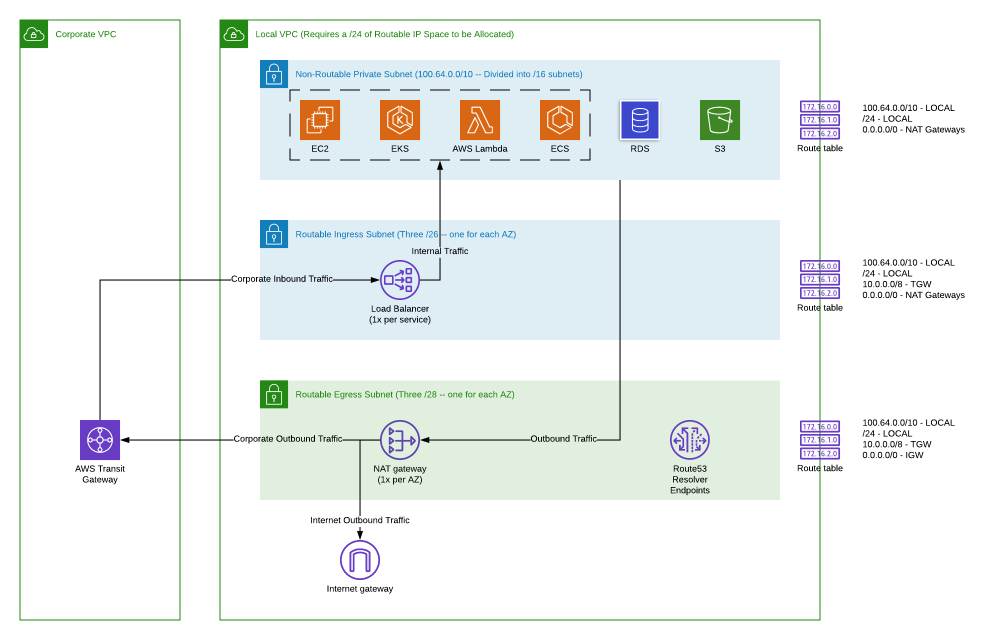

# Terraform Module for AWS Enterprise VPC

This Terraform module manages an opinionated VPC that enables bi-directional service communication with a corporate network using Transit Gateways. It enables a usable IP space of about 600k addresses while only requiring 255 (/24) addresses to be "routable" on the corporate network.

It's intended to be used in a hub and spoke AWS Account architecture where there is limited "routable" IP space, but many services that require access to corporate services but only have one or two ingress points (via ELB/ALB/NLB).

**Requires**:
- AWS Provider
- Terraform 0.12

## Architecture



## Resources Created

[VPC Module](https://github.com/terraform-aws-modules/terraform-aws-vpc) Resources: 
- VPC
- DHCP Option Set (Using AmazonProvidedDNS - if you need Hybrid DNS, use in conjunction with the [Route53 Resolver for Hybrid DNS](https://registry.terraform.io/modules/lorenzoaiello/hybrid-dns/aws) module)
- Internet Gateway
- Subnets (Egress, Ingress, Database, Elasticache, Redshift)
- Route Tables
- NAT Gateways (3x / 1x Availability Zone)
- EIPs for NAT Gateways (1x NAT Gateway)
- Transit Gateway Attachment and Routes

**Estimated Operating Cost**: $ 99.00 / month

- $ 33 / month for NAT Gateways (3x)

## Example

```hcl-terraform
module "enterprise-vpc" {
  source                       = "lorenzoaiello/aws-vpc-enterprise/aws"
  version                      = "x.y.z"
  name                         = "myVPCName"
  routable_vpc_cidr            = "10.134.0.0/24"
  routable_vpc_egress_subnets  = ["10.134.0.0/26", "10.134.0.64/26", "10.134.0.128/26"]
  routable_vpc_ingress_subnets = ["10.134.0.192/28", "10.134.0.208/28", "10.134.0.224/28"]
  tgw_id                       = "tgw-abc1234"
  corporate_cidr_tgw           = "10.0.0.0/8"
}
```

If you need to add additional routes for corporate CIDR blocks, you can do something like this:

```hcl-terraform
resource "aws_route" "dx-private1" {
  route_table_id         = module.vpc.private_route_table_ids[0]
  destination_cidr_block = "192.168.0.0/24"
  transit_gateway_id     = "tgw-abc1234"
  depends_on             = [module.vpc.tgw_attachment]
}

resource "aws_route" "dx-private2" {
  route_table_id         = module.vpc.private_route_table_ids[1]
  destination_cidr_block = "192.168.0.0/24"
  transit_gateway_id     = "tgw-abc1234"
  depends_on             = [module.vpc.tgw_attachment]
}

resource "aws_route" "dx-private3" {
  route_table_id         = module.vpc.private_route_table_ids[2]
  destination_cidr_block = "192.168.0.0/24"
  transit_gateway_id     = "tgw-abc1234"
  depends_on             = [module.vpc.tgw_attachment]
}

resource "aws_route" "dx-egress" {
  route_table_id         = module.vpc.private_route_table_ids[0]
  destination_cidr_block = "192.168.0.0/24"
  transit_gateway_id     = "tgw-abc1234"
  depends_on             = [module.vpc.tgw_attachment]
}
```

## Variables

| Name | Description | Type | Default | Required |
|------|-------------|------|---------|:--------:|
| corporate\_cidr\_tgw | The entire corporate CIDR block that is routable over the transit gateway. | `string` | n/a | yes |
| name | Name to be used on all the resources as identifier | `string` | `""` | no |
| routable\_vpc\_cidr | The complete DX-routable CIDR block for the VPC. Recommend this to be a /24 CIDR block. | `string` | n/a | yes |
| routable\_vpc\_egress\_subnets | The list of CIDR blocks for the VPC to use for egress (internet and corporate). Recommend this to be three /28 CIDR block. | `list` | n/a | yes |
| routable\_vpc\_ingress\_subnets | The list of CIDR blocks for the VPC to use for ingress (load balancers). Recommend this to be three /26 CIDR block. | `list` | n/a | yes |
| tags | A map of tags to add to all resources | `map(string)` | `{}` | no |
| tgw\_id | Transit gateway ID to connect the VPC to. Leave blank to not connect it. | `string` | `""` | no |


## Outputs

| Name | Description |
|------|-------------|
| egress\_route\_table\_ids | A list of the egress route table IDs |
| ingress\_route\_table\_ids | A list of the ingress route table IDs |
| nonroutable\_cidr\_blocks | A list of the non-routable CIDR blocks in use for the VPC |
| nonroutable\_subnets | A list of the non-routable subnets in the VPC |
| tgw\_attachment | The transit gateway attachment ID |
| vpc\_id | The VPC ID that was created |

